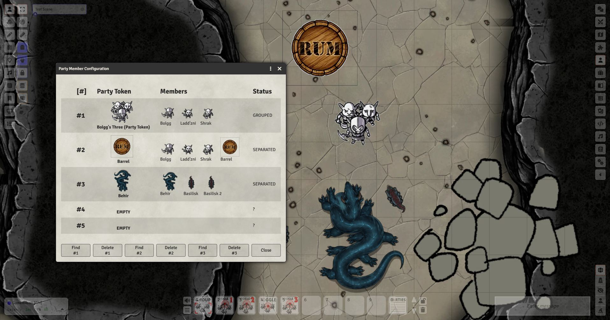
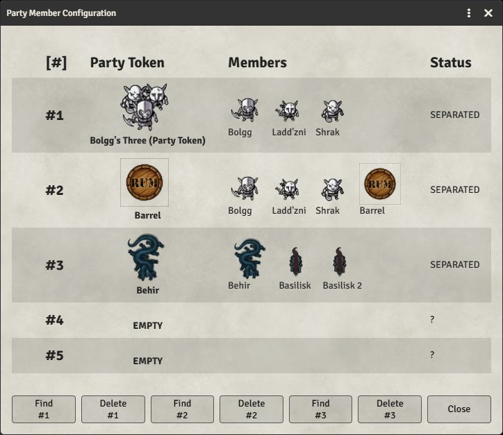
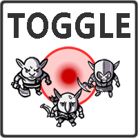
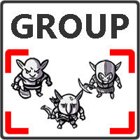
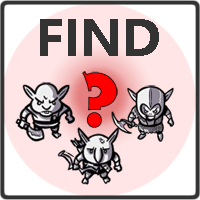
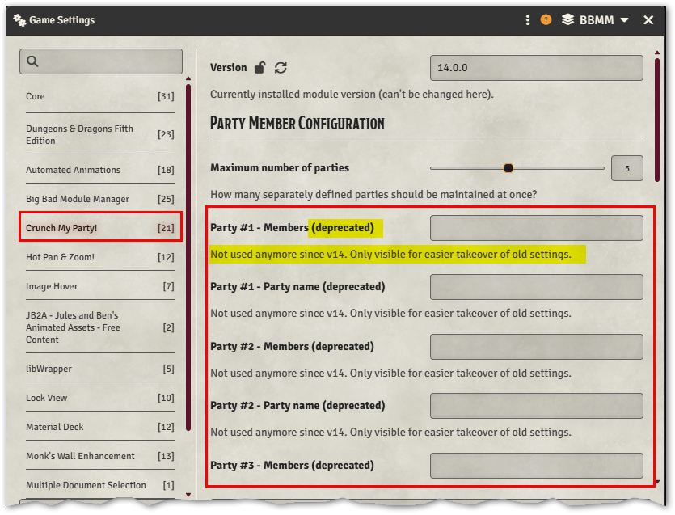

The **major** version number in my modules (like "13") always reflects the
Foundry VTT **core** version it is compatible with (and recommended for).

## 14.0.0
### 2026-06-27 - v14 compatibility and a HUGE overhaul [#13](https://github.com/coffiarts/FoundryVTT-crunch-my-party/issues/13))
- ***v14 compatibility**: Hurray, it is here! And much more than that: Foundry's new version finally forced me to completely overhaul the mechanics - which was long due anyway.  So I took the chance to improve tons of things and add new features, such as ...

[Crunch My Party! - Video Howto (new v14 overhaul!)](https://youtu.be/KCJD19fJnMg)

- **New Party Management**: Defining groups is way more elegant now, with extended prompt support. E.g.: Use a new macro button (to be found in the included compendium) to show all your party assignments at once (with images), and to quickly find or delete party configurations.

- **Party members be leaders**: Now you can (optionally) pick any party member to serve as the party token - getting rid of the necessity to always have a separate "group token" at hand.
- **Graceful handling of missing or duplicate scene tokens**: A token of your party is missing in the scene, because you forgot to drop it there? No problem: The mod will now handle this tolerantly. You can work with incomplete groups. On the other hand, detection of unintended duplicate tokens in the scene has been improved and made better understandable.
- **Macros be simple**: The predefined Macros / Macro Buttons (in the compendium) have been extended by "generic" versions without a fixed party number. They'll prompt you to conveniently pick the party you want, so there's a lot more flexibility.

- **So what's the hook??** Yes, of course, there's always one ;-) - Your previous group settings can't be migrated automatically - you'll have to recreate them by hand. I apologize for this tradeoff. BUT it's not THAT bad: Just refer to the lists in your mod settings (though out-of-function and deprecated, I'll leave them in for now so that your party definitions aren't lost. They'll be dropped in one of the future versions).

- **Famous last words**: Please say good-bye to v12. I've dropped support for it, because I am confident that this should be fine by now. But of course we're still backward compatible with v13!

## 13.1.0
### 2025-09-27 - Adding support for elevations (implementing feature request [#12](https://github.com/coffiarts/FoundryVTT-crunch-my-party/issues/12))
- Different elevations of group members in "vertical" maps are now handled properly: When "crunching" your party, everyone now gets teleported to the same elevation as the selected target token. This prevents tokens to unintendedly end up in places they shouldn't see.
- A new config option "Force target token selection" allows fine-control for this.

## 13.0.3
### 2025-09-16 - Maintenance release, fixing a couple of fancy technical details no one would ever have noticed ;-)
- Some more post-polishing for the minor [#10](https://github.com/coffiarts/FoundryVTT-crunch-my-party/issues/10) issue (which kept returning again and again like a hungry cat ;-))
- Chat message optimizations
- Silent removal of deprecated, unnoticed rubbish ("nothing to see here, please pass along")

## 13.0.2
### 2025-09-03 - v13 compatibility fix
- Another post-fix for [#10](https://github.com/coffiarts/FoundryVTT-crunch-my-party/issues/10): Error when opening Settings menu, preventing titles in the config menu to appear squashed

## 13.0.1
### 2025-09-03 - Two v13 compatibility fixes
- Fixes [#10](https://github.com/coffiarts/FoundryVTT-crunch-my-party/issues/10): Error when opening Settings menu
- Fixes [#11](https://github.com/coffiarts/FoundryVTT-crunch-my-party/issues/11): Tokens cannot be grouped/ungrouped in different rooms (blocked by walls)

## 13.0.0
### 2025-08-05 - v13 compatibility
- Just this. No changes in functionality. Fixes request for compatibility [#9](https://github.com/coffiarts/FoundryVTT-crunch-my-party/issues/9)

## 12.0.1
### 2024-07-22 - Fixes issue #7 (sounds not working in specific setup)
- An adjustment to audio file paths that fixes broken audio for certain users
- Minor optimizations (better settings menu,chat info box now links to changelog)
- Minor technical optimizations

## 12.0.0
### 2024-06-06 - v12 compatibility release
- Self-explaining. No functional changes.
- Still backward-compatible with v11.

## 11.0.8
### 2024-04-24 - Optimized JB2A compatibility by Syrious
- Thanks to a pull request provided by github member [Syrious](https://github.com/Syrious), JB2A animations now also work with the Patreon version of JB2A, not only with the free version. See [Pull Request](https://github.com/coffiarts/FoundryVTT-crunch-my-party/pull/5).

## 11.0.7
### 2024-04-02 - Keybinding support
- Adds optional keybindings for toggling and finding groups (gamemasters only).
- "Optional" means: There are no preassigned key combinations. Assign them to your liking in the game settings (or ignore it if you don't want to use it). My personal preference is **SHIFT + 1/2/3/4/5** for finding and **CTRL + SHIFT + 1/2/3/4/5** for toggling groups.

## 11.0.6
### 2023-12-22 - Bugfix for [issue #2](https://github.com/coffiarts/FoundryVTT-crunch-my-party/issues/2)
Fixes a [stupid little bug](https://github.com/coffiarts/FoundryVTT-crunch-my-party/issues/2) that has been in there since the beginning. 
Whenever one was trying to crunch/explode a party in a scene that was only _viewed_, but not the _active_ scene, an incomprehensible error was thrown onto the screen.
 Now you can use it safely both in active and viewed-only scenes.
 Thanks to github user [cwlithgow](https://github.com/cwlithgow) for spotting this!

## 11.0.5
### 2023-12-19 - Hotfix for 11.0.4
- The newly introduced optimization for tolerating missing tokens on "crunch" could cause unintuitive error messages when the (still mandatory) group token was missing from the scene. Fixed now.

## 11.0.4
### 2023-12-19 - Fixing the "Floating tokens bug" plus minor enhancements
- Fixes a nasty bug which could (during toggling) sporadically cause tokens to float openly across the scene instead of being displaced, hidden & shown at once. This may have been game breaking whenever those tokens had sight! The code for the automated token displacement has been completely refactored, thanks to some very helpful guys on discord (honeybadger, mxzf and others). Extra credits given! 
- Toggling from separate tokens to the single party token (aka "crunching") now tolerates missing tokens (the party must go on, even of it isn't complete). I believe it to be more intuitive and easier to use that way.
- Optimization in settings menu: Audio files are now easily selectable by filepicker
- Various internal refactorings

## 11.0.3
### 2023-07-16 - Add missing (only recommended) dependency (Sequencer)
- If people are using my mod (as STRONGLY recommended) in combination with JB2A [Animated Assets](https://github.com/Jules-Bens-Aa/JB2A_DnD5e) and [Automated Animations](https://github.com/otigon/automated-jb2a-animations), then this won't work unless they're also using [Sequencer](https://github.com/fantasycalendar/FoundryVTT-Sequencer) by [fantasycalendar](https://github.com/fantasycalendar). Otherwise, my mod can't make use of the animations. Those three are commonly used together, but it may not be self-explaining.
  So even I (dull as I am) simply forgot to mention this in earlier versions. I added that missing recommended dependency now.
- Declared end of Foundry v10 backward-compatibility

## 11.0.2
### 2023-06-27 - Changelog & Readme optimization for Module Management+
- Refactored documentation so that it can be properly displayed & linked in-game by [Module Management+](https://github.com/mouse0270/module-credits), 
  which is a veeeery helpful mod that I waaaaarmly recommend!

## 11.0.1
### 2023-06-05 - Compatibility info simplified
- Reduced verified compatibility to main version (11) of FoundryVTT (instead of specific patch version) 
  This gets rid of unnecessary "incompatibility risk" flags with every new patch version.

## 11.0.0
### 2023-05-28 - Foundry 11 compatibility release
- Actually, nothing has changed, technically. It had already been compatible, and it is still backward-compatible with v10. 
  
  From now on, major versions will always reflect the corresponding Foundry VTT major version 
  (i.e. mod version 11.x.x => compatible with Foundry v11, and so on)
   
  Strictly speaking, this mod has already been compatible with v11 (and it is still backward-compatible with v10!), but I detected and fixed some weak points on the go: 
  <li>
  <b>Bugfix: Improved handling of sound and animations and related mod dependencies</b> 
  For (optional) usage of animations, it doesn't suffice to use JB2A, but you also need to have the Automated Animations mod (see description further below). 
  </li>
  <li>
  <b>Bugfix: Audio will now also play when JB2A and Automated Animations are <i>not</i> installed.</b> 
  For (optional) usage of animations, it doesn't suffice to use JB2A, but you also need to have the Automated Animations mod (see description further below). 
  </li>
  <li>Various minor readme corrections</li>

## 1.1.0
### 2023-03-05 - First official release - Going out into the world!
