# Crunch My Party! for Foundry VTT
<table style="border:0">
  <tr>
    <td></td>
    <td>
        

          *The* perfect utility for the game master handling multiple tokens as one party. Easily collapse arbitrary groups of scene tokens (representing parties) into an easy-to-use single "party token", and vice versa. Manage up to 5 separate parties with up to 25 members each!
        

        

          "Once there were three little goblins ... 
            ... eager to form a PARTY! 
            So here's their story."
    

    </td>
  </tr>
</table>

## Video demos on youtube
### Some quick impressions for fun
[Crunch My Party! - Video Demo](https://youtu.be/ix66vZ8A0OI)

### Howto Video
[Crunch My Party! - Video Howto](https://youtu.be/ix66vZ8A0OI)

[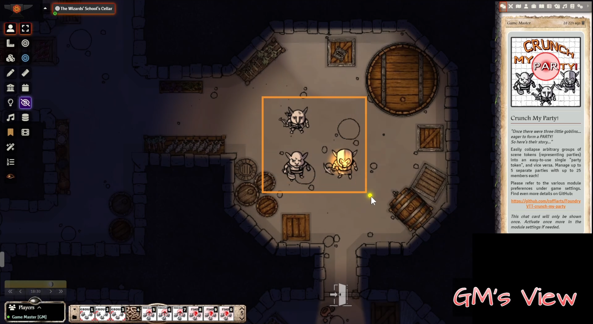](https://youtu.be/F8f29g0SLqA)

- [What ist does ...](#what-ist-does-)
- [Changelog](#changelog)
- [How it works ...](#how-it-works-)
  * [GROUP - Define a new party](#group---define-a-new-party)
  * [TOGGLE - CRUNCH an exploded party into one single party token](#toggle---crunch-an-exploded-party-into-one-single-party-token)
  * [TOGGLE - EXPLODE a collapsed party into separate member tokens](#toggle---explode-a-collapsed-party-into-separate-member-tokens)
  * [FIND - Jump to an already defined party in the scene](#find---jump-to-an-already-defined-party-in-the-scene)
- [Known restrictions](#known-restrictions)
- [Control it by macro](#control-it-by-macro)
- [Adjustable module settings (i.e. game settings)](#adjustable-module-settings--ie-game-settings-)
- [Recommended modules in combination with this one](#recommended-modules-in-combination-with-this-one)
  * [Notes on using Hot Pan and Zoom](#notes-on-using-hot-pan-and-zoom)
  * [Notes on using JB2A](#notes-on-using-jb2a)
- [Compatibility and Dependencies](#compatibility-and-dependencies)
- [Upcoming features](#upcoming-features)
- [Credits](#credits)

<small><i><a href='http://ecotrust-canada.github.io/markdown-toc/'>Table of contents generated with markdown-toc</a></i></small>

## What ist does ...
*The* perfect utility for the game master handling multiple tokens as one party.

Are you a game master who frequently needs to control a whole bunch of scene actors at once?
- Maybe you like remote controlling your players' tokens while they're travelling through a dungeon in between encounters?
- Or you need to handle larger groups of foes?

Then you might know the tediousness of having to micromanage all those tokens... aaaargh! It simply ends up in stressful slapstick, breaking your game flow.

This module of mine is meant as a comfortable solution to it:
Easily collapse arbitrary groups of scene tokens (representing parties) into an easy-to-use single "party token", and vice versa. Manage up to 5 separate parties with up to 25 members each!

## Changelog
<table style="border:0">
    <tr>
        <th colspan="3" style="text-align: left">Latest Version</th>
    </tr>
    <tr>
        <td>Pre-Release 1.1.0</td>
        <td>2023-03-05</td>
        <td>
            <b>First official release - Going out into the world!</b>
        </td>
    </tr>
</table>

<!--details>
Click to see older versions

<table>
    <tr>
        <th>Release</th>
        <th>Date</th>
        <th>Changes</th>
    </tr>
    <tr>
        <td>xyz</td>
        <td>YYYY-MM-DD</td>
        <td>Description</td>
    </tr>
</table>
</details-->

## How it works ...
At first, before experimenting by yourself, please have a look at the [Video demo on youtube](https://youtu.be/ix66vZ8A0OI)

The main functions, briefly explained:

### GROUP - Define a new party
1. Create a custom token representing your party in "crunched" state
2. Add that party token to the scene and disable it (remember its name in correct spelling)
3. Select any tokens in the scene that should join your party
4. Run the related "Group Party #x" macro (see section [Control it by macro](#control-it-by-macro))
5. Enter the name of the party token from step 1.

=> You're done. Your party is defined! HURRAY!!

### TOGGLE - CRUNCH an exploded party into one single party token
1. Optional: If you want to control exactly where the party token should appear, select one (exactly ONE!) of your member tokens as the target.
2. Run the related "Toggle Party #x" macro (see section [Control it by macro](#control-it-by-macro))

That's it: 

=> Your party members will be automatically rendered invisible and moved (secretly) out of the way to the top-left corner of your scene
=> Your predefined / preassigned party token will be moved from its "hiding place" in the top left corner to the previous location of your members and rendered visible.
=> If you should have selected ONE member in step 1., this will be the position of the party token. Otherwise, the party token will appear at the location of one arbitrary member.

### TOGGLE - EXPLODE a collapsed party into separate member tokens
1. Run the related "Toggle Party #x" macro (see section [Control it by macro](#control-it-by-macro))

That's it:

=> Your single party token will be automatically rendered invisible and moved (secretly) out of the way to the top-left corner of your scene
=> The related member tokens will be moved from their "hiding place" in the top left corner to the previous location of your party token and rendered visible.

### FIND - Jump to an already defined party in the scene
1. Run the related "Find Party #x" macro (see section [Control it by macro](#control-it-by-macro))

=> That's it. Your canvas view moves automatically to the scene location of that party and automatically selects its tokens (be it in crunched or exploded state).

## Known restrictions
- Token names may not (currently) have ***commas*** (comma is used as delimiter for the token names list stored in user prefs). If many people should comply about it, I'll try to make the delimiter char configurable (see [Upcoming features](#upcoming-features))
- The "EXPLODE" animation of large groups appears somewhat clumsy and slow. That is known and by design. I had to build in a 200 msec timeout between every two tokens, to improve stability (no better solution found yet). If you are eager to contribute, have a look at the [related disussion on Discord](https://discord.com/channels/170995199584108546/722559135371231352/1080590427012485211)

## Control it by macro
Use the exposed `class PartyCruncher` - just like this, it's a no-brainer:

    PartyCruncher.group(<partyNumber); // Assigns the selected list of tokens to another party tokens identified by a name you type in
    PartyCruncher.toogle(<partyNumber); // toggles the specified party between a single "party token" (crunched) and separate "member tokens" (explode)
    PartyCruncher.find(<partyNumber); // autoselect the specified party in the scene, moving focus and canvas you to it

The module comes already bundled with a predefined set of 5 macros per action (for up to 5 configurable parties of tokens), recognizable by there icons:

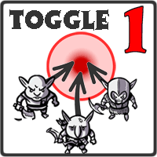
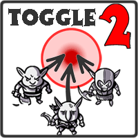
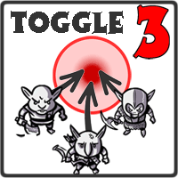
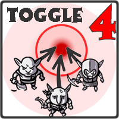
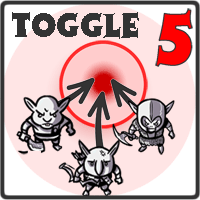

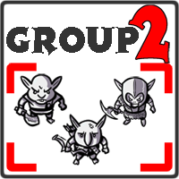
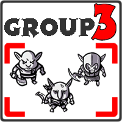
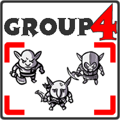
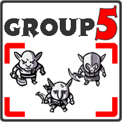

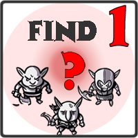
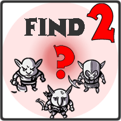
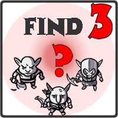
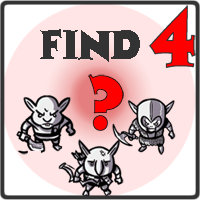
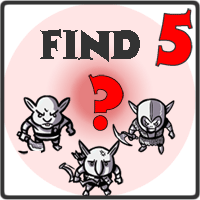

## Adjustable module settings (i.e. game settings)

## Recommended modules in combination with this one
- [Hot Pan & Zoom!](https://github.com/coffiarts/FoundryVTT-hot-pan) by coffiarts: Keeps your players' canvas position and zoom in sync with your GM screen, especially useful when toggling and finding groups 
- [Jules&Ben's Animated Assets (JB2A)](https://github.com/Jules-Bens-Aa/JB2A_DnD5e) by Jules & Ben: Allows autoplaying of animations on toggling

Presence of these modules is optional! If installed, ***Crunch my Party!*** will automatically detect and handle them. Just lean back and enjoy.
However, note the additional options that derive from it: ...

### Notes on using Hot Pan and Zoom
If [Hot Pan & Zoom!](https://github.com/coffiarts/FoundryVTT-hot-pan) is installed and active, TOGGLE and FIND functions will, by default, make use of it: I.e. both the GM's and the player's views will be automatically panned and zoomed to the location of the related party.

If you do NOT want players' views to be synchronized (e.g. if you don't want them to see what you are doing), you can bypass Hot Pan & Zoom! with an additional macro parameter, like this:

    PartyCruncher.toggleParty(<partyNumber>, false); // false means: useHotPanIfAvailable = false (default is true)
    PartyCruncher.findParty(<partyNumber>, false); // false means: useHotPanIfAvailable = false (default is true)

### Notes on using JB2A
[Jules&Ben's Animated Assets (JB2A)](https://github.com/Jules-Bens-Aa/JB2A_DnD5e) is used by my mod to play atmospheric animations on crunch and explode.

You may choose to override the default animation with another one of your choice by adjusting the game setting **"Explode animation (optional)"**. See [Adjustable module settings (i.e. game settings)](#adjustable-module-settings--ie-game-settings-).

## Compatibility and Dependencies
- Tested with Foundry VTT 10 in world system "dsa5" / "tde5" (The Dark Eye). But I consider it system-agnostic.
- No hard dependencies, but some warmly recommended *optional* 3rd-party modules are listed further above (see there to understand why I recommend them).

## Upcoming features
Things I am *considering* to do in the future (given proper demand for it - feedback welcome!):

- `small`: support commas in token names (i.e. making the delimiter character configurable via user prefs)
- `small` to `?`: find a robust solution for the token movement on EXPLODE, which is currently still potentially unreliable (tokens stacking onto each other erratically). If you're eager to contribute, feel free to have a look at the [related discussion on Discord](https://discord.com/channels/170995199584108546/722559135371231352/1080590427012485211).   

Feel free to follow the ["dev" branch on GitHub](https://github.com/coffiarts/FoundryVTT-crunch-my-party/tree/dev) to stay tuned: [https://github.com/coffiarts/FoundryVTT-crunch-my-party/tree/dev](https://github.com/coffiarts/FoundryVTT-crunch-my-party/tree/dev)

## Credits
- [Jules & Ben](https://www.patreon.com/JB2A) for their magnificient [Animated Assets](https://github.com/Jules-Bens-Aa/JB2A_DnD5e) module (see [Recommended modules in combination with this one](#recommended-modules-in-combination-with-this-one))
- [Navadaux](https://freesound.org/people/Navadaux/) for the "explode" sound provided via [freesound.org](https://freesound.org/people/Navadaux/sounds/547172/), released under [CCO 1.0 license](http://creativecommons.org/publicdomain/zero/1.0/) 
- [Glaneur de sons](https://freesound.org/people/Glaneur%20de%20sons/) for the "crunch" sound provided via [freesound.org](https://freesound.org/people/Glaneur%20de%20sons/sounds/420616/), released under [CC BY 3.0 license](https://creativecommons.org/licenses/by/3.0/)
- Video background music: ***"Marty Gots a Plan"***, ***"Circus of Freaks"***, ***"Sneaky Snitch"*** and ***"Investigations"*** by the incredible, unbelievable, most-famous, soo-much-beloved [Kevin MacLeod (incompetech.com)](https://incompetech.com/music/royalty-free/music.html), released under [CC BY 4.0 License](http://creativecommons.org/licenses/by/4.0/)
