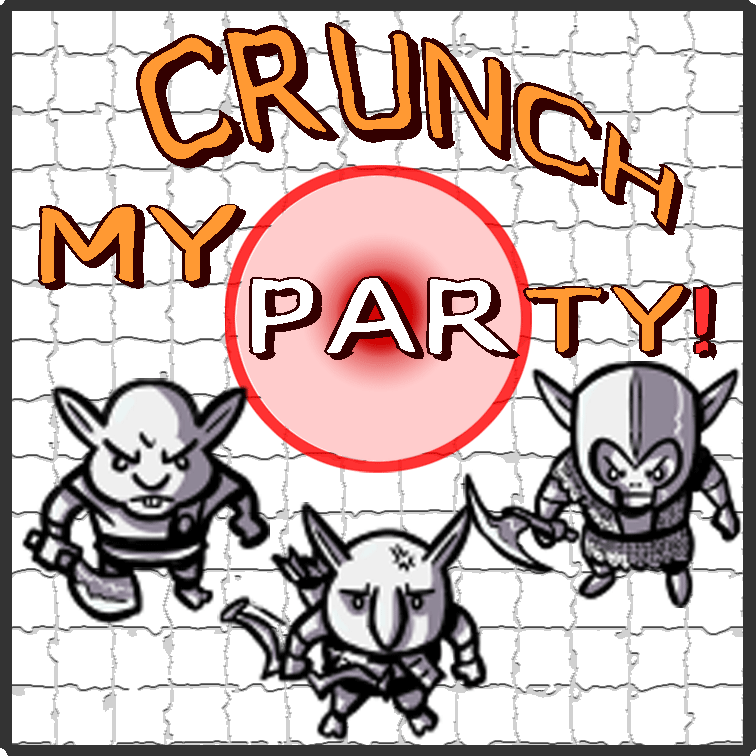

# Crunch My Party! for Foundry VTT
<table style="border:0">
  <tr>
    <td></td>
    <td> 
         
        <i><strong>"Here goes ... 
            ... some fancy ... 
            ... slogan"</strong></i>
    </td>
  </tr>
</table>

## Video demo on youtube
[crunch-my-party Demo](https://youtu.be/crunch-my-party)

- [What does it do ...](#what-does-it-do-)
- [Changelog](#changelog)
- [Upcoming features](#upcoming-features)
- [Tech stuff](#tech-stuff)
  * [Adjustable module settings (i.e. game settings)](#adjustable-module-settings--ie-game-settings-)
  * [Control it by macro!](#control-it-by-macro-)
  * [Compatibility and Dependencies](#compatibility-and-dependencies)

  <small><i><a href='http://ecotrust-canada.github.io/markdown-toc/'>Table of contents generated with markdown-toc</a></i></small>

## What does it do ...

## Changelog
<table style="border:0">
    <tr>
        <th colspan="3" style="text-align: left">Latest Version</th>
    </tr>
    <tr>
        <td>xxx</td>
        <td>YYYY-MM-DD</td>
        <td>
            <ul>
                <li><b>Change topic:</b> 
                    Description</li>
            </ul>
        </td>
    </tr>
</table>

Click to see older versions

<table>
    <tr>
        <th>Release</th>
        <th>Date</th>
        <th>Changes</th>
    </tr>
    <tr>
        <td>xyz</td>
        <td>YYYY-MM-DD</td>
        <td>Description</td>
    </tr>
</table>

## Upcoming features
Feel free to follow the ["dev" branch on GitHub](https://github.com/coffiarts/FoundryVTT-crunch-my-party/tree/dev) to stay tuned: [https://github.com/coffiarts/FoundryVTT-crunch-my-party/tree/dev](https://github.com/coffiarts/FoundryVTT-crunch-my-party/tree/dev)

Some things I am *considering* to do (feedback welcome!):

- `small`: some small feature
- `big`: some big feature

## Tech stuff
### Adjustable module settings (i.e. game settings)
This screenshot shows the default values.

### Control it by macro!
Use the exposed `class MyModuleMacroAPI` - just like this, it's a no-brainer:

Some more variants:

    // Toggle specifically on and off (pretty obvious)
    MyModuleMacroAPI.someFunction();

### Compatibility and Dependencies
- some dependencies
